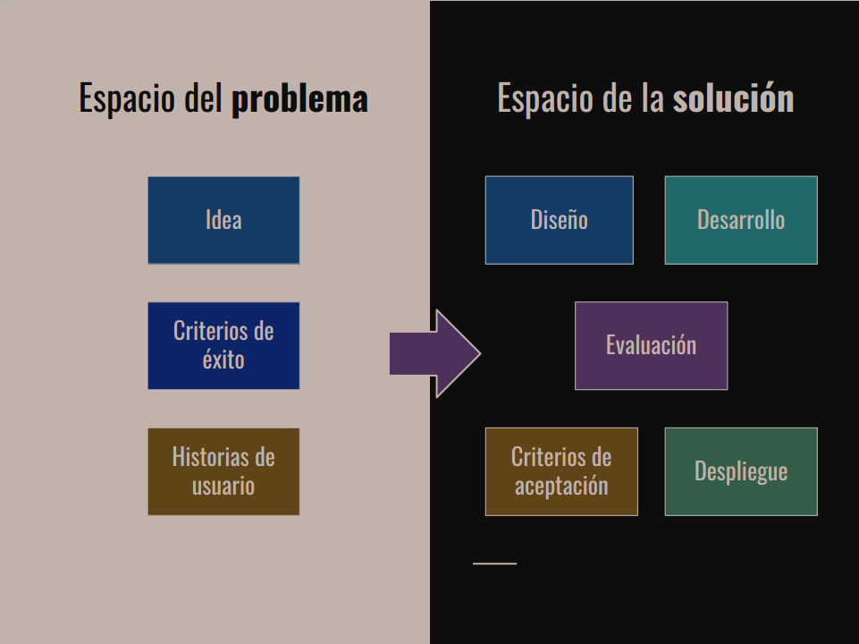
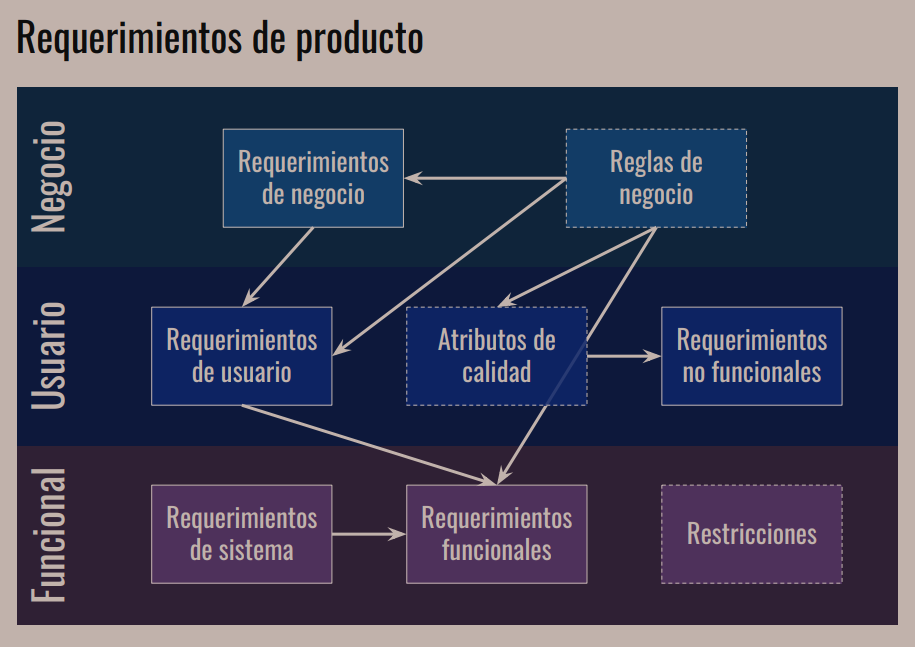
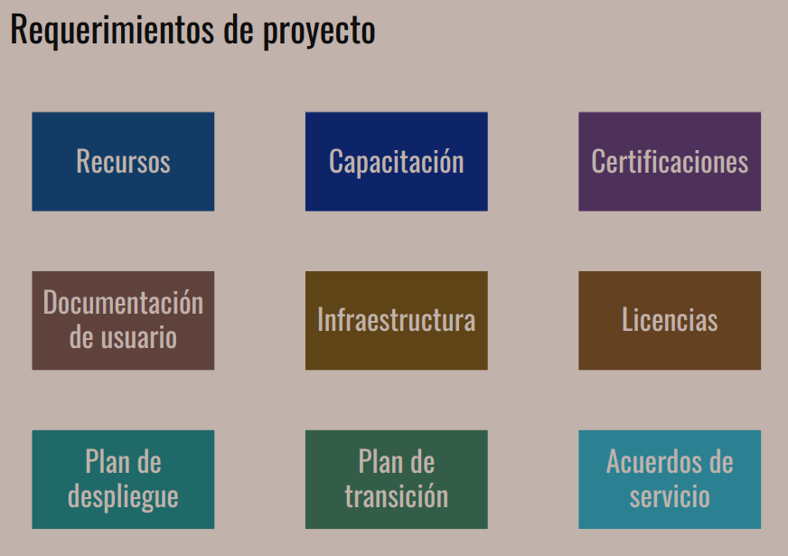
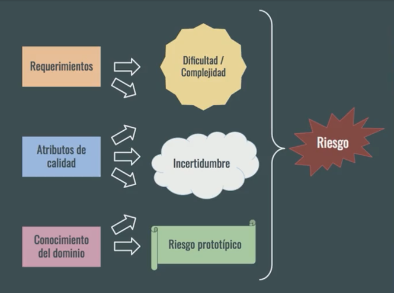
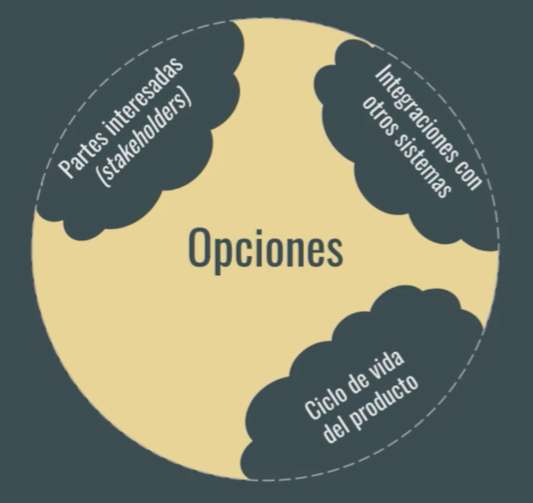

# Arquitectura de Software

En la arquitectura del software se habla de:

• Estructuras.

• Modelos con diagramas.

• Comunicación entre diferentes sistemas o incluso entre diferentes módulos del sistema.

## Etapas del Proceso de Desarrollo de Software

* **Análisis de Requerimientos.** Todo nace de un problema o análisis a resolver, se requiere conocer qué es lo que se va a construir o lo que se quiere hacer. Sacar los requerimientos funcionales y no funcionales. Su resultado es la comprensión del problema a resolver.

* **Diseño de la Solución.** Análisis profundo del problema y generar la propuesta de diseño de una solución.

* **Desarrollo y Evaluación.** Es donde los programadores están involucrados, llevando a cabo los test para validar si lo que se está realizando es lo deseado. Evaluar cual es el test de tecnologias necesario.

* **Despliegue.** Entregar el producto al usuario final. Generar o habilitar la estructura para poder desplegar el producto.

* **Mantenimiento y Evolución.** Compuesta por desarrollo y despliegue, se está atento a la detencción de errores así como en la evaluación de nuevas funcionalidades que se requieran agregar.

## Dificultades

En la etapa de diseño y desarrollo estamos concentrados en encontrar cuáles son los problemas que queremos resolver. Estos problemas los podemos dividir en dos grandes tipos de problemas.

**Esenciales:** Tratan sobre la especificación, diseño y comprobación del concepto. Estos los podemos dividir en 4.

* La complejidad, cuándo lo que tenemos que resolver es complejo en si mismo, por ejemplo calcular la mejor ruta entre ciudades.
* La conformidad. El software en qué contexto se va a usar y cómo debe adecuarse a ese contexto.
* Tolerancia al cambio. Una vez terminado el software, ¿va a poder cambiarse sin mucha dificultad?
* Invisibilidad. 

**Accidentales:** Son aquellos detalles de la implementación y producción actual. Está relacionado con la plataforma que vamos a utilizar, tecnología, lenguajes, frameworks, integraciones, etc.

¿Cómo resolver las dificultades esenciales?

* No desarrollar. Comprar un producto que solucione el problema que tenemos.
* Prototipado rápido. Relacionado con las metodologías ágiles, pero con un enfoque más desechable en los productos eleborados.
* Desarrollo evolutivo. También implementa medotodlogías ágiles pero más alineado a la creación y acumulación de sistemas en desarrollos iterados.
* Grandes Diseñadores. Son aquellos que saben astraerse del problema y diseñar soluciones más elegantes y simples. Mejor calidad en el desarrollo.

## Roles

Es importante que diferenciemos el ROL del puesto de trabajo, hay roles que pueden ser desarrollados por la misma persona.

* **Experto del dominio:** En una metodología tradicional, es la persona a la que acudimos para entender las necesidades del negocio. En metodologías Ágiles --> stakeholders.

* **Analista:** funcional/de negocio, la persona responsable de definir los requerimientos que van a llevar al software a u buen puerto. En el caso de Ágiles el dueño del producto es quien arma las historias y que nos acompaña en el proceso de construcción del software.

* **Administrador de sistemas / DevOps:** Es el rol de operaciones y desarrollo, son las personas responsables de la infraestructura que alojara nuestra aplicación.

* **Equipo de desarrollo:** QA / Testing se encargan de la evaluación de nuestro software, comprobar que lo que se está haciendo es lo que se espera que se haga. Desarrolladores involucrados en la construcción del software. Arquitecto, diseña la solución y análisis de los requerimientos, es un papel más estratégico. La arquitectura emerja del trabajo de un equipo bien gestionado.

* **Gestor del proyecto / facilitador:** Llevan al equipo a través del proceso iterativo e incremental, entender lo que pasa con el equipo y motivar el avance en el desarrollo del producto.

## Arquitectyra y Metodologías

## Entender el problema

La parte más importante es separar la comprensión del problema de la propuesta de solución. Ciertas cuestiones tecnológicas como la plataforma o la arquitectura en general o el estilo a implementar como parte del problema cuando en realidad son detalles de implementación.

## Requerimientos de producto

Los podemos dividir en tres.

• Capa de requerimientos de negocio, son reglas del negocio que alimentan los requerimientos del negocio.

• Capa de usuario, tienen que ver en cómo el usuario se desenvuelve usando el sistema, qué atributos del sistema se deben poner por encima de otros.

• Capa Funcional, se ven alimentados por requerimientos del sistema, ¿qué cosas tienen que pasar operativamente?
Esta capa se ve afectada por las restricciones que pueden afectar operativamente a lo funcional.

## Requerimientos de proyecto

• Tienen que ver más con el rol de gestor de proyectos, se usan para dar prioridad a los requerimientos del producto.

• Estos dos mundos de requerimientos hablan de las prioridades del equipo de trabajo del proyecto.

• Tiene que ver con requerimientos logísticos, que no tienen que ver con el desarrollo del software.

## Requerimientos Significativos para la Arquitectura del Producto

• Requerimientos funcionales: (Funciones indispensables) Tienen que ver con las historias de usuarios, que hablan sobre específicamente lo que hace el sistema, por ejemplo que un usuario ingrese al sistema.

• Requerimientos no funcionales: (Atributos de calidad): son aquellos que agregan cualidades al sistema, por ejemplo que el ingreso de ese usuario sea de manera segura.

## Riesgos

Es necesario identificar los riesgos para poder priorizarlos y atacarlos en orden y asegurar que las soluciones arquitectónicas que propongamos resuelvan los problemas más importantes.

Identificación de los riesgos:

• Toma de Requerimientos (Requerimientos funcionales):
Se calificará su riesgo de acuerdo a su dificultad o complejidad.

• Atributos de calidad (Requerimientos NO funcionales):
Se calificará su riesgo de acuerdo a la incertidumbre que genere, cuanto mas incertidumbre hay, mas alto es el riesgo.

• Conocimiento del dominio:
Riesgo prototípico, son aquellos que podemos atacar de forma estándar.

No es necesario mitigarlos todos, debemos siempre tener en cuenta y dar prioridad a aquellos riesgos que ponen en peligro la solución que se está construyendo.

## Restricciones

En el contexto de un proceso de desarrollo de software se refiere a las restricciones que limitan las opciones de diseño o implementaciones disponibles al desarrollar.

Los **StakeHolders**, nos pueden poner limitaciones relacionadas con su contexto de negocio, ejemplo:

• Las limitaciones legales, la implementación de un producto podría tener restricciones en algún país, y esto seria una limitante a considerar para el desarrollo del producto.

• Limitaciones técnicas, relacionadas con integraciones con otros sistemas.

• El ciclo de vida del producto, agregará limitaciones al producto, por ejemplo a medida que avanza el proceso de implementación el modelo de datos va a ser más difícil de modificar.

Nota:
El arquitecto debe balancear entre los requerimiento y las restricciones.

## Arquitectura, Panorama y Definición

Un estilo de arquitectura es una colección de decisiones de diseño, aplicables en un contexto determinado, que restringen las decisiones arquitectónicas específicas en ese contexto y obtienen beneficios en cada sistema resultante.