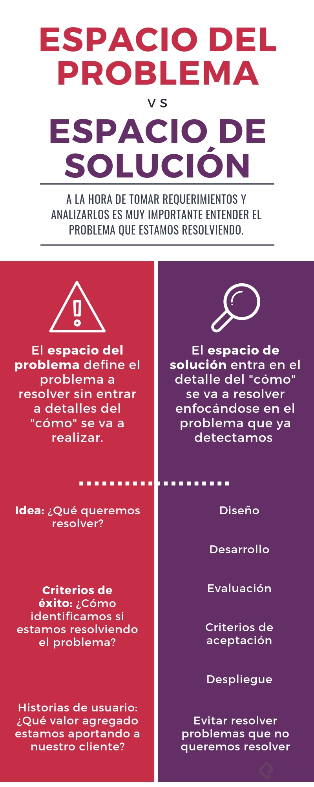

# Arquitectura de Software

En la arquitectura del software se habla de:

• Estructuras.

• Modelos con diagramas.

• Comunicación entre diferentes sistemas o incluso entre diferentes módulos del sistema.

## Etapas del Proceso de Desarrollo de Software

* **Análisis de Requerimientos.** Todo nace de un problema o análisis a resolver, se requiere conocer qué es lo que se va a construir o lo que se quiere hacer. Sacar los requerimientos funcionales y no funcionales. Su resultado es la comprensión del problema a resolver.

* **Diseño de la Solución.** Análisis profundo del problema y generar la propuesta de diseño de una solución.

* **Desarrollo y Evaluación.** Es donde los programadores están involucrados, llevando a cabo los test para validar si lo que se está realizando es lo deseado. Evaluar cual es el test de tecnologias necesario.

* **Despliegue.** Entregar el producto al usuario final. Generar o habilitar la estructura para poder desplegar el producto.

* **Mantenimiento y Evolución.** Compuesta por desarrollo y despliegue, se está atento a la detencción de errores así como en la evaluación de nuevas funcionalidades que se requieran agregar.

## Dificultades

En la etapa de diseño y desarrollo estamos concentrados en encontrar cuáles son los problemas que queremos resolver. Estos problemas los podemos dividir en dos grandes tipos de problemas.

**Esenciales:** Tratan sobre la especificación, diseño y comprobación del concepto. Estos los podemos dividir en 4.

* La complejidad, cuándo lo que tenemos que resolver es complejo en si mismo, por ejemplo calcular la mejor ruta entre ciudades.
* La conformidad. El software en qué contexto se va a usar y cómo debe adecuarse a ese contexto.
* Tolerancia al cambio. Una vez terminado el software, ¿va a poder cambiarse sin mucha dificultad?
* Invisibilidad. 

**Accidentales:** Son aquellos detalles de la implementación y producción actual. Está relacionado con la plataforma que vamos a utilizar, tecnología, lenguajes, frameworks, integraciones, etc.

¿Cómo resolver las dificultades esenciales?

* No desarrollar. Comprar un producto que solucione el problema que tenemos.
* Prototipado rápido. Relacionado con las metodologías ágiles, pero con un enfoque más desechable en los productos eleborados.
* Desarrollo evolutivo. También implementa medotodlogías ágiles pero más alineado a la creación y acumulación de sistemas en desarrollos iterados.
* Grandes Diseñadores. Son aquellos que saben astraerse del problema y diseñar soluciones más elegantes y simples. Mejor calidad en el desarrollo.

## Roles

Es importante que diferenciemos el ROL del puesto de trabajo, hay roles que pueden ser desarrollados por la misma persona.

* **Experto del dominio:** En una metodología tradicional, es la persona a la que acudimos para entender las necesidades del negocio. En metodologías Ágiles --> stakeholders.

* **Analista:** funcional/de negocio, la persona responsable de definir los requerimientos que van a llevar al software a u buen puerto. En el caso de Ágiles el dueño del producto es quien arma las historias y que nos acompaña en el proceso de construcción del software.

* **Administrador de sistemas / DevOps:** Es el rol de operaciones y desarrollo, son las personas responsables de la infraestructura que alojara nuestra aplicación.

* **Equipo de desarrollo:** QA / Testing se encargan de la evaluación de nuestro software, comprobar que lo que se está haciendo es lo que se espera que se haga. Desarrolladores involucrados en la construcción del software. Arquitecto, diseña la solución y análisis de los requerimientos, es un papel más estratégico. La arquitectura emerja del trabajo de un equipo bien gestionado.

* **Gestor del proyecto / facilitador:** Llevan al equipo a través del proceso iterativo e incremental, entender lo que pasa con el equipo y motivar el avance en el desarrollo del producto.

## Arquitectyra y Metodologías

## Entender el problema

La parte más importante es separar la comprensión del problema de la propuesta de solución. Ciertas cuestiones tecnológicas como la plataforma o la arquitectura en general o el estilo a implementar como parte del problema cuando en realidad son detalles de implementación.

## Requerimientos de producto

Los podemos dividir en tres.

• Capa de requerimientos de negocio, son reglas del negocio que alimentan los requerimientos del negocio.

• Capa de usuario, tienen que ver en cómo el usuario se desenvuelve usando el sistema, qué atributos del sistema se deben poner por encima de otros.

• Capa Funcional, se ven alimentados por requerimientos del sistema, ¿qué cosas tienen que pasar operativamente?
Esta capa se ve afectada por las restricciones que pueden afectar operativamente a lo funcional.

## Requerimientos de proyecto

• Tienen que ver más con el rol de gestor de proyectos, se usan para dar prioridad a los requerimientos del producto.

• Estos dos mundos de requerimientos hablan de las prioridades del equipo de trabajo del proyecto.

• Tiene que ver con requerimientos logísticos, que no tienen que ver con el desarrollo del software.

## Requerimientos Significativos para la Arquitectura del Producto

• Requerimientos funcionales: (Funciones indispensables) Tienen que ver con las historias de usuarios, que hablan sobre específicamente lo que hace el sistema, por ejemplo que un usuario ingrese al sistema.

• Requerimientos no funcionales: (Atributos de calidad): son aquellos que agregan cualidades al sistema, por ejemplo que el ingreso de ese usuario sea de manera segura.

## Riesgos

Es necesario identificar los riesgos para poder priorizarlos y atacarlos en orden y asegurar que las soluciones arquitectónicas que propongamos resuelvan los problemas más importantes.

Identificación de los riesgos:

• Toma de Requerimientos (Requerimientos funcionales):
Se calificará su riesgo de acuerdo a su dificultad o complejidad.

• Atributos de calidad (Requerimientos NO funcionales):
Se calificará su riesgo de acuerdo a la incertidumbre que genere, cuanto mas incertidumbre hay, mas alto es el riesgo.

• Conocimiento del dominio:
Riesgo prototípico, son aquellos que podemos atacar de forma estándar.

No es necesario mitigarlos todos, debemos siempre tener en cuenta y dar prioridad a aquellos riesgos que ponen en peligro la solución que se está construyendo.

## Restricciones

En el contexto de un proceso de desarrollo de software se refiere a las restricciones que limitan las opciones de diseño o implementaciones disponibles al desarrollar.

Los **StakeHolders**, nos pueden poner limitaciones relacionadas con su contexto de negocio, ejemplo:

• Las limitaciones legales, la implementación de un producto podría tener restricciones en algún país, y esto seria una limitante a considerar para el desarrollo del producto.

• Limitaciones técnicas, relacionadas con integraciones con otros sistemas.

• El ciclo de vida del producto, agregará limitaciones al producto, por ejemplo a medida que avanza el proceso de implementación el modelo de datos va a ser más difícil de modificar.

Nota:
El arquitecto debe balancear entre los requerimiento y las restricciones.

## Arquitectura, Panorama y Definición

Un estilo de arquitectura es una colección de decisiones de diseño, aplicables en un contexto determinado, que restringen las decisiones arquitectónicas específicas en ese contexto y obtienen beneficios en cada sistema resultante.

Ningún patrón tiene solo beneficios ni trae la solución a todos los software.

## Estilos Arquitectónicos

### Llamado y Retorno

Cada uno de los componentes hacen invocaciones a los componentes externos y estos retornan información. Cada componente hace un llamado y espera una respuesta.

* **Programa principal y subrutinas:** Es el estilo más básico donde se tiene una rutina y se manda a llamar otra subrutina en donde la subrutina puede retornar o no un resultado, pero la rutina principal continua hasta que acabe la subrutina.

* **Orientada a Objetos:** Una versión con esteroides del estilo anterior. Se utiliza para aplicaciones que vamos a mantener por mucho tiempo. Tratamos de juntar el estado de la aplicación creando objetos los cuales tienen una interfaz publica (interfaz en este caso se refiere a una definición de funciones o estructura que esta clase puede implementar) donde la llamada no es solo una subrutina, sino objetos que interactuán entre si.

* **Arquitectura multinivel:** Son diferentes componentes que se van a comunicar en un orden en especifico donde un componente principal crea el llamado a un componente inferior en algún momento, un ejemplo de esto son las aplicaciones cliente-servidor.

### Flujo de Datos

No estamos preocupados por la secuencia de ejecución sino por como los datos van a ir de un lugar a otro.

• **Lote secuencial:** Lo importante es ejecutar una pieza de código y que el final de esa pieza ya procesada pase a una siguiente etapa.

• **Tubos y filtros:** Se tiene un string o un flujo de datos continuo en donde cada aplicación recibe continuamente esos datos los procesa y los hace como salida a otra aplicación o al final de la ejecución.

Nota:

En el estilo de flujo de datos lo que se tiene son diferentes aplicaciones que van a estar conectadas en general en tiempo real por lo tanto ya no se necesita interacción con el usuario para decidir cuándo empieza un proceso o cuando termina otro.

Cuando usamos el estilo de arquitectura de flujo de datos:

• Cuando tenemos un proceso que tiene que tener una salida clara pero que puede ser separado en partes en donde tenemos parte a parte lo que necesitamos hacer.

• Cuando necesitamos un stream de entrada parte a parte ir procesándolo y tener una salida al final del túnel.
 
### Centradas en Datos

* **Estilo de pizarrón.** permite centralizar los datos en una sola base de datos, alimentada por varias partes involucradas, una vez que todas las partes interesadas ingresan los datos, el sistema centralizado genera una salida.

* **Estilo Centralizado.** En este caso el sistema posee los datos centralizados en una base de datos, y hay dos (02) sistemas que comparten la misma base de datos.

* **Estilo Basado en Reglas.** En este caso el sistema que centraliza los datos, tiene la capacidad de entender los datos y consultas que realiza el cliente, generando salidas inteligentes. (inteligencia artificial).

### Componentes Independientes

* **Invocación Implícita:** Tiene que ver con que nuestra aplicación puedan mandar mensajes entre si, sin que sepa a quien le esta hablando.

* **Invocación Explícita:** Tiene que ver con el desarrollo de componentes que si se conocen entre si, pero que sean desarrollado independientemente.

ARQUITECTURA ORIENTADAS A SERVICIOS:
El Enterprise Services Busses, sabe que proceso tiene que llevar a cabo para lograr su cometido, dando a los componentes la información que éstos requieran. El ESB, es inteligente.

Es necesario tener en cuenta que cualquier actualización del sistema, mantiene conectado a los componentes que brindan servicios de consulta.

## Comparación de Estilos

**Estilos Monolíticos.**

* Es más fácil darle prioridad a la eficiencia de las comunicaciones.

* Son más fáciles de probar.

* Curva de aprendizaje son más fáciles, todas las piezas estan en el mismo lugar. (Los microservicios son fáciles de entender).

* La capacidad de modificación es más fácil.

* La modularización es más fácil de romper, por lo que es más fácil no garantizar esa separación a largo plazo.

* En la usabilidad, es mas costoso, porque habría que respaldar toda la aplicación y no pequeños microservicios.

* Puede ser un desafío para el despliegue, porque habría que garantizar que toda la aplicación o sistema se adapta a ese contexto específico.

**Estilos Distribuidos.**

* Es más fácil darle prioridad a la eficiencia de las comunicaciones.

* Para hacer una prueba de principio a fin hay que tener todos los componentes disponibles .

* La curva de aprendizaje es más difícil, porque habría que entender todas las piezas de los componentes.

* Al ser desplegadas independientemente, son versionadas independientemente, y esta variación de serviones hace mas complejo su modificación.

* La modularidad, es más fácil porque los componentes que son desplegados independiente.

* La disponibilidad se pueden tener multiples copias del sistema. por lo que este disponible es mas barato.

* La adaptabilidad es más fácil en el despliegue porque los componente se despliegan independientemente en múltiples contextos.

## Desarrollo de Proyecto

se comienza con los requerimientos del sistema:

Criterio de éxito:

Conectar rápidamente a un cliente con un profesional de confianza.
Garantizar el aumento del volúmen de trabajo al profesional.
Idea: Definición de una forma ideal de como se satisface una necesidad. Ejemplo: Tener una forma mucho más sencilla de solicitar un servicio de plomería que llegue a mi casa con un plomero que se conozca.

-Historias de usuarios: Definir las experiencias que los usuarios han tenido respecto a la solución de su necesidad. Ejemplo:

Experiencia de un cliente x: quiero contactar a un profesional en el momento para reparar un problema en mi hogar.
Experiencia de un cliente y: quiero conocer la experiencia del profesional para decidir a quien contacto.
Experiencia de un profesional x: quiero cobrar mi trabajo realizado para seguir prestando el servicio.
Experiencia de un profesional y: necesito tener más repertorio de personas para ampliar mi currículo de trabajo y flujo del mismo.
Requerimientos más técnicos:

Etapas de la prestación de servicio:
Solicitar, aceptar y finalizar una prestación de servicio de forma segura.
Comunicación: La forma en como el cliente solicita el servicio a su hogar.
Evaluación: Como se evalua los profesionales y clientes para futuros tiempos
Riesgos

Son referentes a historias de los usuarios.

Ejemplo:

El cliente utiliza un servicio y no completa el pago en un tiempo determinado

La persona que solicita el servicio no puede confirmar quien es la persona

Restricciones

Limites que tiene nuestro proyecto de acuerdo a variables.

Ejemplo:

Recursos disponibles para el desarrollo: programadores, equipos de cómputo, energía, comida, lugar de trabajo, servicios públicos, etc.

Registro de impuestos del profesional: Que el profesional cumpla con el pago de impuestos ante las instituciones.

Antecedentes penales: que el profesional cuente con ser un ciudadano ejemplar dentro de la ley.

Teniendo en cuenta todas las restricciones y requerimientos que existe, lo más adecuado es montar una arquitectura cliente-servidor dentro de la web que permite de una manera mucho más sencilla la automatización de procesos.
